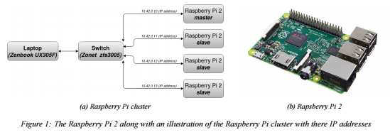

This project presents a way to build a Raspberry Pi cluster where parallel computing of big data will be distributed to multiple nodes using SLURM. The compute nodes will share data on the master node by building a network file system (NFS). The computation of data will then be distributed to the compute nodes using OpenMPI where the code is written in python. The time for which the data has been processed and completed will be compared to that of a regular computer to see how fast a Pi cluster is able to compute big amount of data.

Four Raspberry Pi 2 will be used in the cluster. One of them will be a master and the rest slaves. A USB with a capacity of 128 GB will be used in the master for which file sharing will be utilized between the slaves. The laptop has an Intel Core M-5Y10c CPU 0.80GHz with 4 cores and 8 GB RAM.

For communication between the nodes and the laptop, a network switch with five I/O will be used. Furthermore, four MicroSD cards will be used to store the Raspbian Buster Lite image used to run the nodes. 

The reason for choosing a Raspberry Pi 2 is the low cost of the unit as well as its good performance which will be put to a test in the following sections along with a covering of the setup of the Raspberry Pi cluster.

The report of this project can be found under Report/Head/Report.pdf and code under runtime_calculations. 
