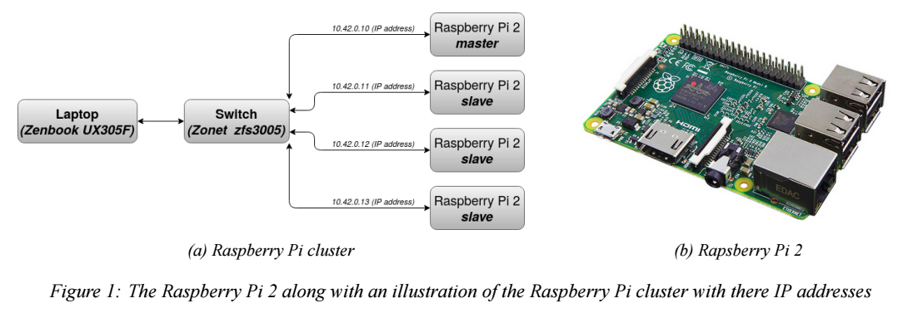
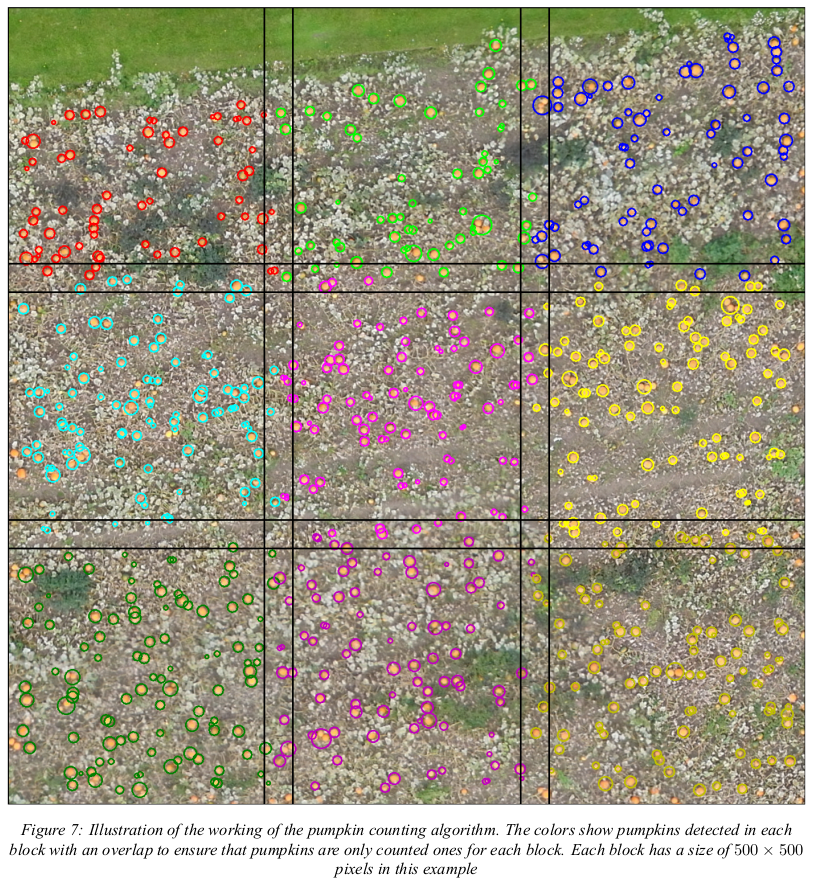

# Raspberry Pi cluster
## _An implementation based on SLURM and OpenMPI for big data handling_

When processing big amount of data or jobs for which a large amount of resources are required, newer computers often tend
to be a pretty expensive solution. If the job does not have to be computed on a single unit, a distribution of the workload on
multiple entities could be a possibility. If one got access to a supercomputer or another campus where multiple machines
are accessible, this could effectively solve your problem. Hence, if parallelism is possible for the given task, a cluster of
nodes could be used to decrease the run time of the calculations.

This project presents a way to build a Raspberry Pi cluster where parallel computing of big data will be distributed to
multiple nodes using SLURM. The compute nodes will share data on the master node by building a network file system
(NFS). The computation of data will then be distributed to the compute nodes using OpenMPI where the code is written
in python. The time for which the data has been processed and completed will be compared to that of a regular computer
to see how fast a Pi cluster is able to compute big amount of data.

Four Raspberry Pi 2 will be used in the cluster. This Raspberry Pi can be seen in Figure 1a. One of them will be a master
and the rest slaves. A USB with a capacity of 128 GB will be used in the master for which file sharing will be utilized
between the slaves. The laptop has an Intel Core M-5Y10c CPU 0.80GHz × 4 with 8 GB RAM.

  

For communication between the nodes and the laptop, a network switch with five I/O will be used. Furthermore, four
MicroSD cards will be used to store the Raspbian Buster Lite image used to run the nodes.

The reason for choosing a Raspberry Pi 2 is the low cost of the unit as well as its good performance.

## _Object segmentation of an orthomosaic for calculating pumpkins_

For testing the cluster and see how well is performs compared to a laptop in regard to operational time, object segmention of a large image of pumpkins were performed. The segmentation of pumpkins can be seen in Figure 7 where blocks of pumpkins are found cand calculated for each block. 

  

  

The results can be seen in Figure 5. Here it can be seen that the cluster in general performs quite well when a number of twelve CPU cores are utilized compared to that of a laptop. The biggest contributor to the increase in runtime for the Raspberry Pi cluster would be the bottleneck of slow communication between the Raspberry Pis because the use of 100 Mbps cables. Moreover, booting from an SD card, compared to that of an SSD harddisk, makes considerable performance decreasement. These could be optimized to achieve better performance. 

The overall theory about this implemenation and how this how this has been implemented can be seen in the report 
[Project - Raspberry Pi cluster](https://github.com/Kenil16/Raspberry_Pi_Cluster/blob/master/Report/Head/Report.pdf).

